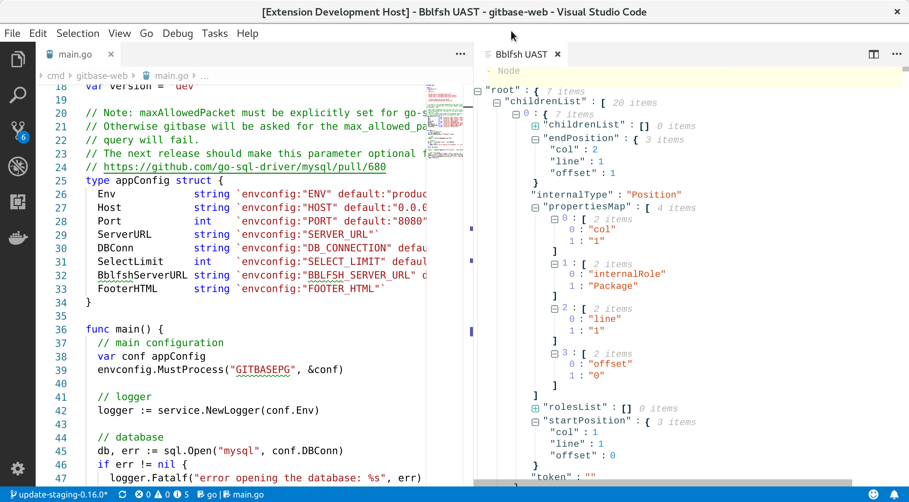

# VSCode uast-viewer

**NOTE**: work in progress

A personal project to visualize [Babelfsih Universal Abstract Syntax Trees (UAST)](https://doc.bblf.sh/) from [Visual Studio Code](https://code.visualstudio.com/) using [the webview API](https://code.visualstudio.com/docs/extensions/webview).



Requires [bblfshd](https://github.com/bblfsh/bblfshd) and [bblfsh JSON proxy](https://github.com/carlosms/bblfsh-json-proxy). Both can be run downloading this project's [docker-compose.yml](./docker-compose.yml) and running:

```bash
docker-compose up
```

Based on:
- https://github.com/rebornix/vscode-webview-react
- https://github.com/bblfsh/uast-viewer

## Development

Run following commands in the terminal

```shell
yarn install
yarn build
```

Then in VS Code  start debugging (F5), and in the Extension Development Host session, run `Bblfsh: Parse UAST` from the command palette.
Right now you can only run production bits (`yarn build`) in the webview. For every change you will need to build and restart debugging.
