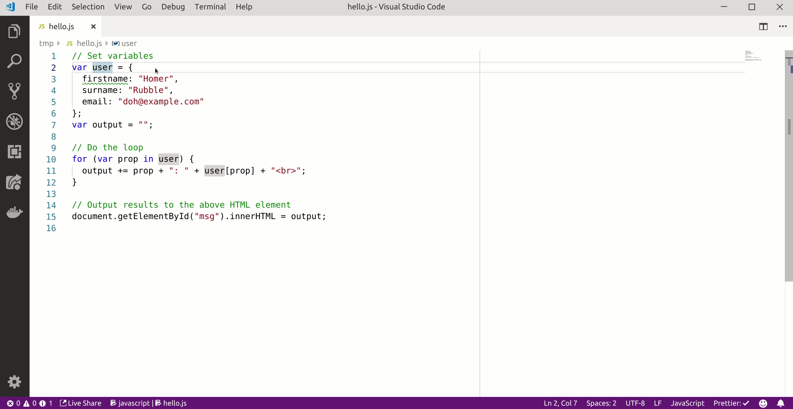

<h1 align="center">
  
  <br/>
  VS Code Babelfish Extension
</h1>

A personal project to visualize [Babelfish Universal Abstract Syntax Trees (UAST)](https://doc.bblf.sh/) from [Visual Studio Code](https://code.visualstudio.com/) using [the webview API](https://code.visualstudio.com/docs/extensions/webview).



## Requirements

Requires [bblfshd](https://github.com/bblfsh/bblfshd) and [bblfsh JSON proxy](https://github.com/carlosms/bblfsh-json-proxy). Both can be run downloading this project's [docker-compose.yml](https://github.com/carlosms/vscode-babelfish/blob/master/docker-compose.yml) and running:

```bash
docker-compose up
```

## Install

The extension is published in the [VS Code Marketplace](https://marketplace.visualstudio.com/items?itemName=carlosms.vscode-babelfish). You can search for **vscode-babelfish** from the VS Code Extensions view and install it from your editor.

Now you can run the command **`Bblfsh: Parse UAST`** from the Command Palette.

## Development

Run following commands in the terminal

```bash
yarn install
yarn build
```

Then in VS Code  start debugging (F5), and in the Extension Development Host session, run `Bblfsh: Parse UAST` from the command palette.
Right now you can only run production bits (`yarn build`) in the webview. For every change you will need to build and restart debugging.

To package locally, install [`vsce`](https://github.com/Microsoft/vscode-vsce) and run:

```bash
vsce package --yarn --baseContentUrl https://github.com/carlosms/vscode-babelfish --baseImagesUrl https://github.com/carlosms/vscode-babelfish
```

To install this extension manually, follow the [official instructions](https://code.visualstudio.com/docs/editor/extension-gallery#_install-from-a-vsix):
- Build locally or download the latest `.vsix` file from the [releases page](https://github.com/carlosms/vscode-babelfish/releases).
- Run the `Extensions: Install from VSIX` command in the VS Code Command Palette, and open the downloaded file.

Based on these projects:
- https://github.com/rebornix/vscode-webview-react
- https://github.com/bblfsh/uast-viewer
